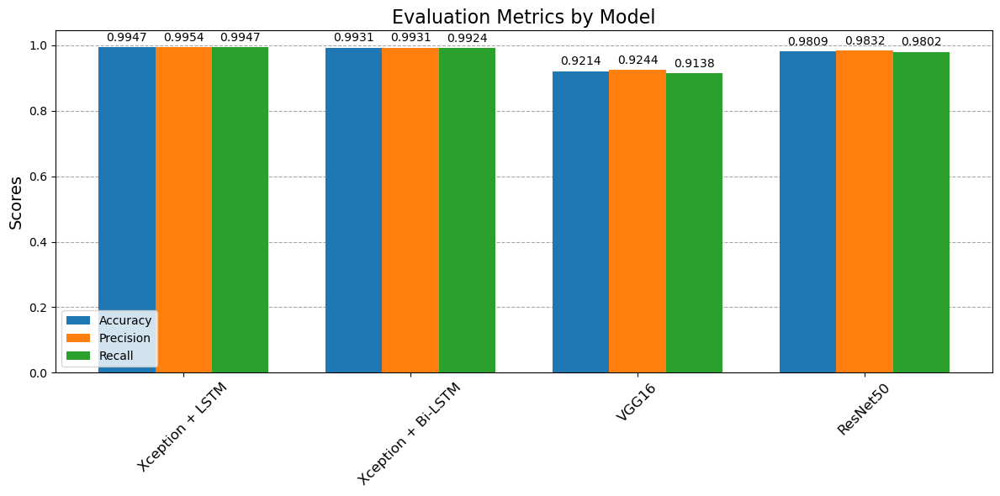

# 🧠 Brain Tumor Detection and Classification using Deep Learning


## 📌 Project Overview
This repository presents a comprehensive analysis and classification model for brain tumors using deep learning techniques. The dataset consists of MRI images of brain tumors. The workflow includes data preprocessing, model training, evaluation, and performance comparison.

---

## 💊 Data Preprocessing
The following preprocessing steps were performed to prepare the data for training:

- Rescaling images to normalize pixel values.
- Applying data augmentation techniques such as rotation, brightness adjustment, width and height shifts, shear transformation, and horizontal flipping.
- Splitting the data into training and validation sets.
- Loading and preprocessing the test data.

---

## 🤖 Models and Metrics
A total of **4 models** were trained and evaluated:

| Model                   | Test Accuracy | Test Precision | Test Recall |
|-------------------------|---------------|----------------|-------------|
| **Xception + LSTM**     | 0.9947        | 0.9954         | 0.9947      |
| **Xception + Bi-LSTM**  | 0.9931        | 0.9931         | 0.9924      |
| **VGG16**               | 0.9214        | 0.9244         | 0.9138      |
| **ResNet50**            | 0.9809        | 0.9832         | 0.9802      |

📌 **Model Evaluation**
- A **Bar Chart Comparison of Accuracy Scores** was created.

<p align="center">
  
</p>

---

## 🖼️ Images of Cancer Types
Below image is representing the four types of cancer:

1. **Image of Cancer Type 1** 
2. **Image of Cancer Type 2** 
3. **Image of Cancer Type 3** 
4. **Image of Cancer Type 4** 

---

## 🚀 How to Run the Project
### 1️⃣ Clone the Repository
```bash
git clone https://github.com/yourusername/brain_tumor_classification.git
cd brain_tumor_classification
```

### 2️⃣ Install Dependencies
```bash
pip install -r requirements.txt
```

### 3️⃣ Run the Jupyter Notebook
```bash
jupyter notebook
```
Open the `.ipynb` file and execute the cells step by step.

---

## 🛠️ Technologies Used
- **Python** 🐍
- **TensorFlow, Keras** for Model Training 🤖
- **Pandas, NumPy** for Data Processing 📊
- **Matplotlib, Seaborn** for Data Visualization 🎨

---

## 📝 Conclusion
This project demonstrates how deep learning can effectively classify brain tumors using various algorithms. The results highlight the effectiveness of combining convolutional neural networks with LSTM and Bi-LSTM layers.

⭐ Feel free to **star** this repo if you found it useful!

👯️ Reach me at [pandeytushart522@gmail.com](mailto:pandeytushart522@gmail.com) or connect on [LinkedIn](https://linkedin.com/in/tushar-pandey-ab94a418a)
